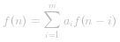
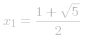
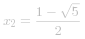
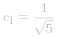
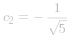

### 📺视频题解  
 [70.爬楼梯.mp4](7f0841fe-83c6-4fab-9702-9eb8932cb037)

### 📖文字题解
#### 方法一：动态规划

**思路和算法**

我们用 *f(x)* 表示爬到第 *x* 级台阶的方案数，考虑最后一步可能跨了一级台阶，也可能跨了两级台阶，所以我们可以列出如下式子：

*f(x) = f(x - 1) + f(x - 2)*

它意味着爬到第 *x* 级台阶的方案数是爬到第 *x - 1* 级台阶的方案数和爬到第 *x - 2* 级台阶的方案数的和。很好理解，因为每次只能爬 *1* 级或 *2* 级，所以 *f(x)* 只能从 *f(x - 1)* 和 *f(x - 2)* 转移过来，而这里要统计方案总数，我们就需要对这两项的贡献求和。

以上是动态规划的转移方程，下面我们来讨论边界条件。我们是从第 *0* 级开始爬的，所以从第 *0* 级爬到第 *0* 级我们可以看作只有一种方案，即 *f(0) = 1*；从第 *0* 级到第 *1* 级也只有一种方案，即爬一级，*f(1) = 1*。这两个作为边界条件就可以继续向后推导出第 *n* 级的正确结果。我们不妨写几项来验证一下，根据转移方程得到 *f(2) = 2*，*f(3) = 3*，*f(4) = 5*......我们把这些情况都枚举出来，发现计算的结果是正确的。

我们不难通过转移方程和边界条件给出一个时间复杂度和空间复杂度都是 *O(n)* 的实现，但是由于这里的 *f(x)* 只和 *f(x - 1)* 与 *f(x - 2)* 有关，所以我们可以用「滚动数组思想」把空间复杂度优化成 *O(1)*。**下面的代码中给出的就是这种实现。**

 [fig1](https://assets.leetcode-cn.com/solution-static/70/70_fig1.gif)


**代码**

```cpp [sol1-C++]
class Solution {
public:
    int climbStairs(int n) {
        int p = 0, q = 0, r = 1;
        for (int i = 1; i <= n; ++i) {
            p = q; 
            q = r; 
            r = p + q;
        }
        return r;
    }
};
```

```Java [sol1-Java]
class Solution {
    public int climbStairs(int n) {
        int p = 0, q = 0, r = 1;
        for (int i = 1; i <= n; ++i) {
            p = q; 
            q = r; 
            r = p + q;
        }
        return r;
    }
}
```

```TypeScript [sol1-TypeScript]
function climbStairs(n: number): number {
    let p: number = 0, q: number = 0, r: number = 1;
    for (let i = 1; i <= n; ++i) {
        p = q; 
        q = r; 
        r = p + q;
    }
    return r;
};

```

```golang [sol1-Golang]
func climbStairs(n int) int {
    p, q, r := 0, 0, 1
    for i := 1; i <= n; i++ {
        p = q
        q = r
        r = p + q
    }
    return r
}
```

**复杂度分析**

- 时间复杂度：循环执行 *n* 次，每次花费常数的时间代价，故渐进时间复杂度为 *O(n)*。
- 空间复杂度：这里只用了常数个变量作为辅助空间，故渐进空间复杂度为 *O(1)*。

#### 方法二：矩阵快速幂

**思路**

以上的方法适用于 *n* 比较小的情况，在 *n* 变大之后，*O(n)* 的时间复杂度会让这个算法看起来有些捉襟见肘。我们可以用「矩阵快速幂」的方法来优化这个过程。

首先我们可以构建这样一个递推关系：
![\left\[\begin{matrix}1&1\\1&0\end{matrix}\right\]\left\[\begin{matrix}f(n)\\f(n-1)\end{matrix}\right\]=\left\[\begin{matrix}f(n)+f(n-1)\\f(n)\end{matrix}\right\]=\left\[\begin{matrix}f(n+1)\\f(n)\end{matrix}\right\] ](./p___left__begin{matrix}_____1_&_1______1_&_0_end{matrix}_right__left__begin{matrix}_____f_n______f_n_-_1__end{matrix}_right__=__left__begin{matrix}_____f_n__+_f_n_-_1______f_n__end{matrix}_right__=__left__begin{matrix}_____f_n_+_1______f_n__end{matrix}_right___.png) 

因此：

![\left\[\begin{matrix}f(n+1)\\f(n)\end{matrix}\right\]=\left\[\begin{matrix}1&1\\1&0\end{matrix}\right\]^n\left\[\begin{matrix}f(1)\\f(0)\end{matrix}\right\] ](./p___left__begin{matrix}_____f_n_+_1______f_n__end{matrix}_right__=__left__begin{matrix}_____1_&_1______1_&_0_end{matrix}_right__^n_left__begin{matrix}_____f_1______f_0__end{matrix}_right___.png) 
令：
![M=\left\[\begin{matrix}1&1\\1&0\end{matrix}\right\] ](./p___M_=_left__begin{matrix}_____1_&_1______1_&_0_end{matrix}_right___.png) 

因此我们只要能快速计算矩阵 *M* 的 *n* 次幂，就可以得到 *f(n)* 的值。如果直接求取 *M^n*，时间复杂度是 *O(n)* 的，我们可以定义矩阵乘法，然后用快速幂算法来加速这里 *M^n* 的求取。

**如何想到使用矩阵快速幂？**

+ 如果一个问题可与转化为求解一个矩阵的 *n* 次方的形式，那么可以用快速幂来加速计算
+ 如果一个递归式形如  ，即齐次线性递推式，我们就可以把数列的递推关系转化为矩阵的递推关系，即构造出一个矩阵的 *n* 次方乘以一个列向量得到一个列向量，这个列向量中包含我们要求的 *f(n)*。一般情况下，形如   可以构造出这样的   的矩阵：
![\left\[\begin{matrix}a_1&a_2&a_3&\cdots&a_m\\1&0&0&\cdots&0\\0&1&0&\cdots&0\\0&0&1&\cdots&0\\\vdots&\vdots&\vdots&\ddots&\vdots\\0&0&0&\cdots&1\\\end{matrix}\right\] ](./p___left______begin{matrix}_________a_1_&_a_2_&_a_3_&_cdots_&_a_m__________1_&_0_&_0_&_cdots_&_0__________0_&_1_&_0_&_cdots_&_0__________0_&_0_&_1_&_cdots_&_0__________vdots_&_vdots_&_vdots_&_ddots_&_vdots__________0_&_0_&_0_&_cdots_&_1______end{matrix}_right___.png) 
+ 那么遇到非齐次线性递推我们是不是就束手无策了呢？其实未必。有些时候我们可以把非齐次线性递推转化为其次线性递推，比如这样一个递推：
*f(x) = (2x-6)c + f(x - 1) + f(x - 2) + f(x - 3)*
我们可以做这样的变换：
*f(x) + xc = [f(x - 1) + (x - 1)c] + [f(x - 2) + (x - 2)c] + [f(x - 3) + (x - 3)c]*
令 *g(x) = f(x) + xc*，那么我们又得到了一个齐次线性递：
*g(x) = g(x - 1) + g(x - 2) + g(x - 3)*
于是就可以使用矩阵快速幂求解了。**当然并不是所有非齐次线性都可以化成齐次线性，我们还是要具体问题具体分析。**

>**留两个思考题：** 
>+ 你能把 *f(x) = 2f(x - 1) + 3f(x - 2) + 4c* 化成齐次线性递推吗？欢迎大家在评论区留言。
>+ 如果一个非齐次线性递推可以转化成齐次线性递推，那么一般方法是什么？这个问题也欢迎大家在评论区总结。

**代码**

```java [sol2-Java]
public class Solution {
   public int climbStairs(int n) {
       int[][] q = {{1, 1}, {1, 0}};
       int[][] res = pow(q, n);
       return res[0][0];
   }
   public int[][] pow(int[][] a, int n) {
       int[][] ret = {{1, 0}, {0, 1}};
       while (n > 0) {
           if ((n & 1) == 1) {
               ret = multiply(ret, a);
           }
           n >>= 1;
           a = multiply(a, a);
       }
       return ret;
   }
   public int[][] multiply(int[][] a, int[][] b) {
       int[][] c = new int[2][2];
       for (int i = 0; i < 2; i++) {
           for (int j = 0; j < 2; j++) {
               c[i][j] = a[i][0] * b[0][j] + a[i][1] * b[1][j];
           }
       }
       return c;
   }
}
```

**复杂度**

- 时间复杂度：同快速幂， 。
- 空间复杂度：*O(1)*。

#### 方法三：通项公式

**思路**

之前的方法我们已经讨论了 *f(n)* 是齐次线性递推，根据递推方程 *f(n) = f(n - 1) + f(n - 2)*，我们可以写出这样的特征方程：

* x^2 = x + 1 *

求得  ， ，设通解为 *f(n) = c_1 x_1 ^n + c_2 x_2 ^ n*，代入初始条件 *f(1) = 1*，*f(2) = 1*，得  ， ，我们得到了这个递推数列的通项公式：

![f(n)=\frac{1}{\sqrt{5}}\left\[\left(\frac{1+\sqrt{5}}{2}\right)^{n}-\left(\frac{1-\sqrt{5}}{2}\right)^{n}\right\] ](./p__f_n__=_frac{1}{sqrt{5}}left__left_frac{1+sqrt{5}}{2}right_^{n}_-_left_frac{1-sqrt{5}}{2}right_^{n}_right__.png) 

接着我们就可以通过这个公式直接求第 *n* 项了。

**代码**

```java [sol3-Java]
public class Solution {
    public int climbStairs(int n) {
        double sqrt5 = Math.sqrt(5);
        double fibn = Math.pow((1 + sqrt5) / 2, n + 1) - Math.pow((1 - sqrt5) / 2, n + 1);
        return (int)(fibn / sqrt5);
    }
}
```

**复杂度**

- 时间复杂度： ，`pow` 方法将会用去   的时间。
- 空间复杂度：*O(1)*。

#### 总结

这里形成的数列正好是斐波那契数列，答案要求的 *f(n)* 即是斐波那契数列的第 *n* 项（下标从 *0* 开始）。我们来总结一下斐波那契数列第 *n* 项的求解方法：

+ *n* 比较小的时候，可以直接使用过递归法求解，不做任何记忆化操作，时间复杂度是 *O(2^n)*，存在很多冗余计算。
+ 一般情况下，我们使用「记忆化搜索」或者「迭代」的方法，实现这个转移方程，时间复杂度和空间复杂度都可以做到 *O(n)*。
+ 为了优化空间复杂度，我们可以不用保存 *f(x - 2)* 之前的项，我们只用三个变量来维护 *f(x)*、*f(x - 1)* 和 *f(x - 2)*，你可以理解成是把「滚动数组思想」应用在了动态规划中，也可以理解成是一种递推，这样把空间复杂度优化到了 *O(1)*。
+ 随着 *n* 的不断增大 *O(n)* 可能已经不能满足我们的需要了，我们可以用「矩阵快速幂」的方法把算法加速到  。
+ 我们也可以把 *n* 代入斐波那契数列的通项公式计算结果，但是如果我们用浮点数计算来实现，可能会产生精度误差。