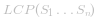
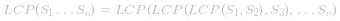
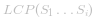
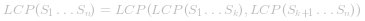
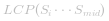
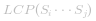
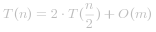
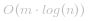
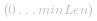
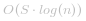

#### 方法一：水平扫描法

**思路**

首先，我们将描述一种查找一组字符串的最长公共前缀   的简单方法。
我们将会用到这样的结论：

 

**算法**

 为了运用这种思想，算法要依次遍历字符串 ![\[S_1\ldotsS_n\] ](./p___S_1__ldots__S_n__.png) ，当遍历到第 *i* 个字符串的时候，找到最长公共前缀  。当   是一个空串的时候，算法就结束了。 否则，在执行了 *n* 次遍历之后，算法就会返回最终答案  。

 [找到最长公共前缀](https://pic.leetcode-cn.com/b647cab7c3d2bd157cecae10917e0b9b671756b92c9cfcefec1a2bdae299c11c-file_1555694071243)


 *图 1. 查找最长公共前缀 （水平扫描法）*
 

 ```java [39J8vye5-Java]
 public String longestCommonPrefix(String[] strs) {
    if (strs.length == 0) return "";
    String prefix = strs[0];
    for (int i = 1; i < strs.length; i++)
        while (strs[i].indexOf(prefix) != 0) {
            prefix = prefix.substring(0, prefix.length() - 1);
            if (prefix.isEmpty()) return "";
        }        
    return prefix;
}
 
```


**复杂度分析**

* 时间复杂度：*O(S)*，S 是所有字符串中字符数量的总和。

    最坏的情况下，*n* 个字符串都是相同的。算法会将 *S1* 与其他字符串 ![\[S_2\ldotsS_n\] ](./p___S_2_ldots_S_n__.png)  都做一次比较。这样就会进行 *S* 次字符比较，其中 *S* 是输入数据中所有字符数量。

* 空间复杂度：*O(1)*，我们只需要使用常数级别的额外空间。


---
#### 算法二：水平扫描

**算法**

想象数组的末尾有一个非常短的字符串，使用上述方法依旧会进行 *S​* 次比较。优化这类情况的一种方法就是水平扫描。我们从前往后枚举字符串的每一列，先比较每个字符串相同列上的字符（即不同字符串相同下标的字符）然后再进行对下一列的比较。

```java [fQk8hcEy-Java]
public String longestCommonPrefix(String[] strs) {
    if (strs == null || strs.length == 0) return "";
    for (int i = 0; i < strs[0].length() ; i++){
        char c = strs[0].charAt(i);
        for (int j = 1; j < strs.length; j ++) {
            if (i == strs[j].length() || strs[j].charAt(i) != c)
                return strs[0].substring(0, i);             
        }
    }
    return strs[0];
}
```


**复杂度分析**

* 时间复杂度：*O(S)*，S 是所有字符串中字符数量的总和。

    最坏情况下，输入数据为 *n* 个长度为 *m* 的相同字符串，算法会进行  *S = m*n* 次比较。可以看到最坏情况下，本算法的效率与算法一相同，但是最好的情况下，算法只需要进行 *n*minLen* 次比较，其中 *minLen* 是数组中最短字符串的长度。

* 空间复杂度：*O(1)*，我们只需要使用常数级别的额外空间。
  

  

---
#### 算法三：分治

**思路**

这个算法的思路来自于LCP操作的结合律。 我们可以发现：
 
，其中   是字符串 ![\[S_1\ldotsS_n\] ](./p___S_1_ldots_S_n__.png)  的最长公共前缀，*1 < k < n*。

**算法**

为了应用上述的结论，我们使用分治的技巧，将原问题   分成两个子问题   与 *LCP(S_{mid+1}, S_j)* ，其中 `mid` =  。 我们用子问题的解 `lcpLeft` 与 `lcpRight` 构造原问题的解  。 从头到尾挨个比较 `lcpLeft` 与 `lcpRight` 中的字符，直到不能再匹配为止。 计算所得的 `lcpLeft` 与 `lcpRight` 最长公共前缀就是原问题的解  。

 [寻找最长公共前缀的分治方法](https://pic.leetcode-cn.com/8bb79902c99719a923d835b9265b2dea6f20fe7f067f313cddcf9dd2a8124c94-file_1555694229984)


*图 2. 查找最长公共前缀的分治方法*


```java [PFSqxqgK-Java]
public String longestCommonPrefix(String[] strs) {
    if (strs == null || strs.length == 0) return "";    
        return longestCommonPrefix(strs, 0 , strs.length - 1);
}

private String longestCommonPrefix(String[] strs, int l, int r) {
    if (l == r) {
        return strs[l];
    }
    else {
        int mid = (l + r)/2;
        String lcpLeft =   longestCommonPrefix(strs, l , mid);
        String lcpRight =  longestCommonPrefix(strs, mid + 1,r);
        return commonPrefix(lcpLeft, lcpRight);
   }
}

String commonPrefix(String left,String right) {
    int min = Math.min(left.length(), right.length());       
    for (int i = 0; i < min; i++) {
        if ( left.charAt(i) != right.charAt(i) )
            return left.substring(0, i);
    }
    return left.substring(0, min);
}
```


**复杂度分析**

最坏情况下，我们有 *n* 个长度为 *m* 的相同字符串。

* 时间复杂度：*O(S)*，*S* 是所有字符串中字符数量的总和，*S=m*n*。

    时间复杂度的递推式为  ， 化简后可知其就是 *O(S)*。最好情况下，算法会进行   次比较，其中 *minLen* 是数组中最短字符串的长度。

* 空间复杂度： 

    内存开支主要是递归过程中使用的栈空间所消耗的。 一共会进行 *log(n)* 次递归，每次需要 *m* 的空间存储返回结果，所以空间复杂度为  。


---
#### 方法四：二分查找法

这个想法是应用二分查找法找到所有字符串的公共前缀的最大长度 `L`。 算法的查找区间是  ，其中 `minLen` 是输入数据中最短的字符串的长度，同时也是答案的最长可能长度。 每一次将查找区间一分为二，然后丢弃一定不包含最终答案的那一个。算法进行的过程中一共会出现两种可能情况：

* `S[1...mid]` 不是所有串的公共前缀。 这表明对于所有的 `j > i S[1..j]` 也不是公共前缀，于是我们就可以丢弃后半个查找区间。

* `S[1...mid]` 是所有串的公共前缀。 这表示对于所有的 `i < j S[1..i]` 都是可行的公共前缀，因为我们要找最长的公共前缀，所以我们可以把前半个查找区间丢弃。

 [使用二分法寻找最长公共前缀](https://pic.leetcode-cn.com/e41778494b56890e2bb7616504e2a0169bbdb409710262eaf5250c635adab9d6-file_1555694009677)


*图 3. 使用二分查找法寻找最长公共前缀*


```java [dCrq2PNp-Java]
public String longestCommonPrefix(String[] strs) {
    if (strs == null || strs.length == 0)
        return "";
    int minLen = Integer.MAX_VALUE;
    for (String str : strs)
        minLen = Math.min(minLen, str.length());
    int low = 1;
    int high = minLen;
    while (low <= high) {
        int middle = (low + high) / 2;
        if (isCommonPrefix(strs, middle))
            low = middle + 1;
        else
            high = middle - 1;
    }
    return strs[0].substring(0, (low + high) / 2);
}

private boolean isCommonPrefix(String[] strs, int len){
    String str1 = strs[0].substring(0,len);
    for (int i = 1; i < strs.length; i++)
        if (!strs[i].startsWith(str1))
            return false;
    return true;
}
```


**复杂度分析**

最坏情况下，我们有 *n* 个长度为 *m* 的相同字符串。

* 时间复杂度： ，其中 *S* 所有字符串中字符数量的总和。

    算法一共会进行 *log(n)* 次迭代，每次一都会进行 *S =  m*n* 次比较，所以总时间复杂度为  。

* 空间复杂度：*O(1)*，我们只需要使用常数级别的额外空间。


---
#### 更进一步

让我们看一个有些不同的问题：

> 给定一些键值字符串 S = ![\[S_1,S_2\ldotsS_n\] ](./p___S_1,S_2_ldots_S_n__.png) ，我们要找到字符串 `q` 与 S 的最长公共前缀。 这样的查询操作可能会非常频繁。

我们可以通过将所有的键值 S 存储到一颗字典树中来优化最长公共前缀查询操作。 如果你想学习更多关于字典树的内容，可以从 [208. 实现 Trie (前缀树)](https://leetcode-cn.com/problems/implement-trie-prefix-tree/solution/) 开始。在字典树中，从根向下的每一个节点都代表一些键值的公共前缀。 但是我们需要找到字符串`q` 和所有键值字符串的最长公共前缀。 这意味着我们需要从根找到一条最深的路径，满足以下条件：

* 这是所查询的字符串 `q` 的一个前缀

* 路径上的每一个节点都有且仅有一个孩子。 否则，找到的路径就不是所有字符串的公共前缀

* 路径不包含被标记成某一个键值字符串结尾的节点。 因为最长公共前缀不可能比某个字符串本身长

**算法**

最后的问题就是如何找到字典树中满足上述所有要求的最深节点。  最有效的方法就是建立一颗包含字符串 ![\[S_1\ldotsS_n\] ](./p___S_1_ldots___S_n__.png)  的字典树。 然后在这颗树中匹配 `q` 的前缀。 我们从根节点遍历这颗字典树，直到因为不能满足某个条件而不能再遍历为止。 

 [使用字典树寻找最长公共前缀](https://pic.leetcode-cn.com/093a52aeacfa1f4b5489bbee3a6d0de22c9dcde6dd72a1c1887f3b75f3eec749-file_1555694178934)


*图 4. 使用字典树查找最长公共前缀*


```java [qSdfDyWx-Java]
public String longestCommonPrefix(String q, String[] strs) {
    if (strs == null || strs.length == 0)
         return "";  
    if (strs.length == 1)
         return strs[0];
    Trie trie = new Trie();      
    for (int i = 1; i < strs.length ; i++) {
        trie.insert(strs[i]);
    }
    return trie.searchLongestPrefix(q);
}

class TrieNode {

    // 子节点的链接数组
    private TrieNode[] links;

    private final int R = 26;

    private boolean isEnd;

    // 非空子节点的数量
    private int size;    
    public void put(char ch, TrieNode node) {
        links[ch -'a'] = node;
        size++;
    }

    public int getLinks() {
        return size;
    }
    // 假设方法 containsKey、isEnd、get、put 都已经实现了
    // 可以参考文章：https://leetcode.com/articles/implement-trie-prefix-tree/
}

public class Trie {

    private TrieNode root;

    public Trie() {
        root = new TrieNode();
    }

// 假设方法 insert、search、searchPrefix 都已经实现了
// 可以参考文章：https://leetcode.com/articles/implement-trie-prefix-tree/
    private String searchLongestPrefix(String word) {
        TrieNode node = root;
        StringBuilder prefix = new StringBuilder();
        for (int i = 0; i < word.length(); i++) {
            char curLetter = word.charAt(i);
            if (node.containsKey(curLetter) && (node.getLinks() == 1) && (!node.isEnd())) {
                prefix.append(curLetter);
                node = node.get(curLetter);
            }
            else
                return prefix.toString();

         }
         return prefix.toString();
    }
}
```


**复杂度分析**

最坏情况下查询字符串 *q* 的长度为 *m* 并且它与数组中 *n* 个字符串均相同。

* 时间复杂度：预处理过程  *O(S)*，其中 *S* 数组里所有字符串中字符数量的总和，最长公共前缀查询操作的复杂度为 *O(m)*。

    建立字典树的时间复杂度为 *O(S)*。在字典树中查找字符串 *q* 的最长公共前缀在最坏情况下需要 *O(m)* 的时间。

* 空间复杂度：*O(S)*，我们只需要使用额外的 *S* 空间建立字典树。